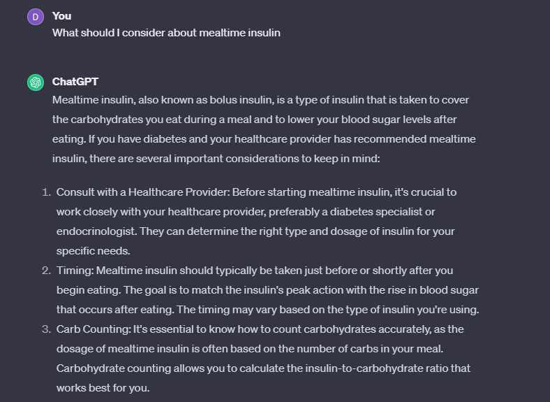

# Diabetes Management Platform

## Increase in diabetic population since 2004

## Motivation

Diabetes is a prevalent and serious health issue across the country. While there is no cure for type-2 diabetes, its impact can be managed through lifestyle changes. Existing diabetes management applications are limited in functionalities and often require the use of multiple applications.

 

## Top Existing Applications

Most existing applications require subscriptions and lack a wide range of functionalities.

## Goal

Our goal is to simplify diabetes management by providing a comprehensive platform that analyzes health data, offers advice, recommendations, and locates nearby healthcare facilities—all through a simple and user-friendly interface.

## Features

- **Diabetes Status Prediction:**
  - Predict whether a patient is diabetic or not.
  - Risk score calculator in case of missing data.
  
- **Real-time Analysis and Visualization:**
  - Analyze and visualize health factors.

- **AI-powered Chatbot:**
  - Interacts with users, considering inputs and relevant details.
  - Answers user queries.

- **Edamam API Integration:**
  - Provides recipe suggestions.

- **Healthcare Facilities Finder:**
  - Uses Google Maps API to locate nearby healthcare facilities.

- **Speech-to-Text:**
  - Improves accessibility.

## Diabetes Status Predictor

### Steps Involved

1. Fetch and clean raw data.
2. Exploratory Data Analysis (EDA).
3. Preprocessing.
4. Train/test/validation set split.
5. Train models on the training set.
6. Validate models using the validation set.
7. Fine-tune models on the validation set.
8. Use the test set for final testing.

### Machine Learning Model

#### Data

- Diabetes prediction dataset.
- 0 implies non-diabetic, 1 implies diabetic.
- Features: Gender, age, hypertension, heart_disease, smoking_history, bmi, HbA1c_level, blood_glucose_level.
- Target variable: "diabetes."
- 100,000 observations.

#### Significant Class Imbalance

- Resampling performed to address class imbalance.
- Performed Undersampling, Oversampling, SMOTE, Undersampling+Oversamply
- SMOTE worked best

Before After

#### Model Training

- Tried Logistic regressor, KNN classifier, Random forest classifier, and XGBoost classifier.
- XGBoost classifier showed the best performance.
- Best model chosen based on:
  - F1 score: Harmonic mean of precision and recall.
  - AUC-ROC score: Ability to distinguish between given classes.

| Model                | F1 Score (Test Set) | AUC-ROC Score (Test Set) |
|----------------------|----------------------|--------------------------|
| Logistic Regression  | 0.5480               | 0.8742                   |
| KNN                  | 0.5294               | 0.8597                   |
| Random Forest        | 0.7355               | 0.8651                   |
| XGBoost              | 0.7870               | 0.8659                   |

#### XGBoost Classifier

- 5-fold grid search cross-validation using roc-auc as the scoring parameter.
- Parameters:
  - n_estimators: 200, 300, 400.
  - Learning rate: 0.01, 0.05, 0.1.
  - Max depth: 1, 2, 3.
- Best parameters: n_estimators: 400, Learning rate: 0.1, Max depth: 3.

## Prediction in app

## Risk Score Calculator

If users do not have all the information to predict diabetes status, they can still calculate their risk scores with a simpler and fewer inputs.
Rather useful feature for non diabetic users.
Used weights from Cambridge diabetes risk score equation. The Cambridge Diabetes Risk Score is validated in populations that underwent diagnostic testing.

## Real-Time Visulization

## Chatbot

Users can ask questions and receive answers from reputable sources through ChatGPT. The chatbot can also generate custom visualizations from user data.

### Methodology

- Assistant API
- Custom prompting
- Knowledge Retrieval
- Code Interpreter

### Iterations

1. **Bot 1: Base ChatGPT - Chatbot**
2. **Bot 2: Diabetes Advisor**
   - Retrieves information from health documents from reputable sources (John Hopkins, National Institute of Health, .edu, or .gov domains).

3. **Bot 3: Health Visualization Chatbot**
   - Provides custom visualizations of user data.

### Prompting

- Bot 2 with attached health documents.

- Bot 3 for custom visualizations (GPT executes Python code on uploaded files).

## Comparison between chatGPT and modified assistant
- ChatGPT VS Modified Assistant

---

---

## Bot 3 for custom Visualization
- GPT executes python code on uploaded files
Here generating a visualization

## Get Recipes

- Suggests diabetic-friendly recipes based on user-provided keywords.
- Uses Edamam API.

## Healthcare Facilities Nearby

- Powered by Google Maps API.
- Finds nearby healthcare units based on the user-provided address.

## Area for Improvment

- Web Browsing feature added to chatbot.
- Facilitate communication between patients and doctors.
- integrate Fitbit for better input take.
- Use LangChain for RAG.
- Extract structured data from unstructured text data .
- Add moderation and constrain user input.
